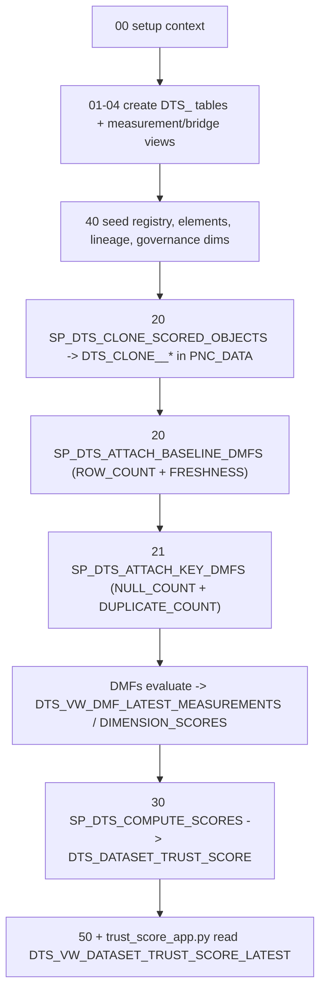

# Plan: Deploy v2 Data Trust Score to EDLE using Snowflake DMFs

## Context

The work belongs in the **`data-trust-score-prototype`** repo (not the current `edl-procurement-repo` working dir). That repo already contains an **uncommitted, in-progress v2 migration** that moves the original POC (`ASATTAR_TRUST_SCORE_POC.DQ_POC`, synthetic, dataset-grain) to **`EDLE_DW_DB.PNC_DATA`** with `DTS_`-prefixed objects and a **DMF-based** measurement layer. My job is to review, complete, deploy, and validate it — not build from scratch.

Key findings from exploring the repo and Snowflake:

- **Framework (from `docs/Data_Trust_Score_v2_Framework_and_Scoring.xlsx` + deck):** 10 dimensions summing to 100 pts (DQ 22, Observability 12, Ownership 12, Classification 12, Auth Source 10, Lineage 10, Definitions 9, Active Issues 5, Usage 5, Feedback 3), 5 trust bands (Certified >=90 ... At Risk 0-39), a DQ Confidence Factor per layer (Bronze 0.90 / Silver 0.75 / Gold 0.60), and a 2x CDE multiplier. All of this is already encoded in `app/config.py`.

- **DMF-first design is already built** across untracked files: clone machinery + `ROW_COUNT`/`FRESHNESS` baseline (`ddl/20_dts_clone_and_dmf.sql`), key-column `NULL_COUNT`/`DUPLICATE_COUNT` (`ddl/21_dts_key_dmfs.sql`), bridge/measurement views (`ddl/22_dts_bridge_views.sql`, `ddl/25_dts_dmf_measurements.sql`), and the scoring engine `SP_DTS_COMPUTE_SCORES()` (`ddl/30_dts_scoring_engine.sql`). Production tables are never altered — DMFs attach only to `DTS_CLONE__*` copies.

- **Correctness checks passed:** all key columns (`POSITION_ID`, `REPORT_EFFECTIVE_DATE`, `REPORT_ENTRY_DATE`; `BUSINESS_PROCESS_WID`, `EFFECTIVEDATE`, `EMPLOYEEID`, `RECORDTYPE`) and the `LOADDATE` freshness anchor **exist** in both DW tables. Seed in `ddl/40_dts_seed_metadata.sql` matches config.

- **Nothing is deployed yet:** no `DTS_` or `DTS_CLONE__*` objects exist in `EDLE_DW_DB.PNC_DATA`. This is a fresh deploy + validate.

- **Two risks found:**

  1. **Deploy role mismatch** — scripts pin `PNC_DEVELOPER_RL`/`PNC_WH`; the active connection is `PNC_AIML_DEVELOPER_RL`/`PNC_AIML_WH`. Need a role that holds `PNC_DATA_RWC` **and** the DMF grants (`EXECUTE DATA METRIC FUNCTION ON ACCOUNT`, `SNOWFLAKE.DATA_METRIC_USER`).
  2. **PUBL-layer column names have spaces** (e.g. `"Position ID"` in `STG_POSITION_REPORT_VW`). CTAS clones preserve those names, so `ADD DATA METRIC FUNCTION ... ON (POSITION_ID)` will fail for PUBL clones. The two **DW tables the user cares about are clean** and unaffected; PUBL is extra scope.

### Deploy / data flow

## Implementation steps

1. **Record project memory + confirm deploy context.** Save project memory under the `data-trust-score-prototype` project (per the user's request to move this conversation there). Confirm the deploy role/warehouse: verify `PNC_DEVELOPER_RL` (or an agreed alternative) holds `PNC_DATA_RWC` and the two DMF grants; if the account uses a different role, update the `USE ROLE`/`USE WAREHOUSE` headers in `ddl/00`, `20`, `21`, `30`, `40` and the `DEPLOY_ROLE`/`DEPLOY_WAREHOUSE` in `config.py` consistently.

2. **Static reconciliation pass (read-only, `only_compile`).** Read the remaining untracked DDL (`ddl/01_dts_registries.sql`, `ddl/02_dts_config.sql`, `ddl/03_dts_measured.sql`, `ddl/04_dts_scores.sql`, `ddl/22`, `ddl/25`) and confirm the column contract the scoring engine depends on is exact: `DTS_VW_DMF_DIMENSION_SCORES` must expose `ROW_COUNT_V, OBS_FRESHNESS_SCORE, OBS_VOLUME_SCORE, DQ_UNIQUENESS_SCORE, ACTIVE_ISSUES_DMF_SCORE`; `DTS_VW_DMF_LATEST_MEASUREMENTS` must expose `METRIC_NAME, VALUE, COLUMN_NAME, REPORT_FAMILY, LAYER`. Fix any drift.

3. **Deploy structure (ddl/00 -> 04).** Run setup + create all `DTS_` tables and the measurement/bridge views in `EDLE_DW_DB.PNC_DATA`.

4. **Seed metadata (ddl/40).** Populate `DTS_DATASET_REGISTRY` (5 scored objects), `DTS_DATA_ELEMENT` (keys + CDE flags), business glossary, ownership/source/classification registries, lineage, interim IDQ DAMA seeds, usage/feedback.

5. **Clone + attach DMFs (ddl/20 then ddl/21).** `CALL SP_DTS_CLONE_SCORED_OBJECTS();` then `CALL SP_DTS_ATTACH_BASELINE_DMFS();` then `CALL SP_DTS_ATTACH_KEY_DMFS();`. Inspect each SP's returned `failed`/`failures` VARIANT. Expected: DW (and INT) clones succeed; **PUBL key/null DMFs may fail on spaced column names** — decide to either (a) scope PUBL out for the prototype, or (b) fix by quoting identifiers in the SP-built SQL / aliasing columns in the CTAS snapshot. Recommend (a) for the initial prototype since the user asked specifically for the two DW tables.

6. **Let DMFs measure, then compute scores (ddl/30).** DMFs evaluate on the `DATA_METRIC_SCHEDULE` (default 1440 min); to avoid waiting, temporarily set a short schedule or otherwise force an initial evaluation so `DTS_VW_DMF_LATEST_MEASUREMENTS` is populated. Then `CALL SP_DTS_COMPUTE_SCORES();` and read `DTS_VW_DATASET_TRUST_SCORE_LATEST`.

7. **Deploy the app (ddl/50 + Python).** Deploy the Streamlit-in-Snowflake app so `app/trust_score_app.py` / `app/shared.py` / `config.py` read the live `DTS_` objects. Confirm the deleted `app/streamlit_app.py` is no longer referenced by `ddl/50`.

8. **Commit the migration.** Stage the new v2 files, the modifications, and the deletions on the `snowflake_cortex_code` branch with a clear message (only when the user asks to commit).

## Verification

- **Compile-only** every DDL file via `snowflake_sql_execute` with `only_compile=true` before executing, to catch identifier/type errors.
- After ddl/40: run the seed-count `SELECT` at the bottom of the file (expect `DATASET_REGISTRY`=5, `DATA_ELEMENT`=17, `LINEAGE`=5).
- After clone/DMF SPs: assert `failed=0` for the DW-scope clones; list attached DMFs with `SELECT * FROM TABLE(INFORMATION_SCHEMA.DATA_METRIC_FUNCTION_REFERENCES(...))` on a clone.
- After measurement: `SELECT * FROM DTS_VW_DMF_LATEST_MEASUREMENTS` returns non-empty `NULL_COUNT`/`ROW_COUNT`/`FRESHNESS` rows for the two DW clones.
- After scoring: `DTS_VW_DATASET_TRUST_SCORE_LATEST` shows a row per scored object with a plausible `TRUST_SCORE`, correct `TRUST_BAND`, populated `MEASURABLE_CEILING`, and `FOUNDATIONAL_GAP_FLAG` behaving as expected. Sanity-check DQ completeness against a manual `COUNT_IF(col IS NULL)/COUNT(*)` on the clone for one key column.
- Run the `sql-verify` subagent over `SP_DTS_COMPUTE_SCORES` for NULL-handling / division-by-zero / join-fanout traps.
- App: launch in Streamlit-in-Snowflake and confirm Portfolio + Dataset Detail pages render live scores (no enablement banner).

## Critical Files

- data-trust-score-prototype/app/config.py - single source of truth (namespace, dimensions/weights, scored objects, keys, bands); any role/scope change starts here.
- data-trust-score-prototype/ddl/30\_dts\_scoring\_engine.sql - the scoring engine; consumes the DMF views and produces the final scores.
- data-trust-score-prototype/ddl/20\_dts\_clone\_and\_dmf.sql + ddl/21\_dts\_key\_dmfs.sql - clone + DMF attachment (the DMF-over-manual-SQL core).
- data-trust-score-prototype/ddl/40\_dts\_seed\_metadata.sql - registry + governance-dimension seeds driving the rollup.
- data-trust-score-prototype/ddl/25\_dts\_dmf\_measurements.sql - measurement extraction views whose column contract the scoring engine depends on.
