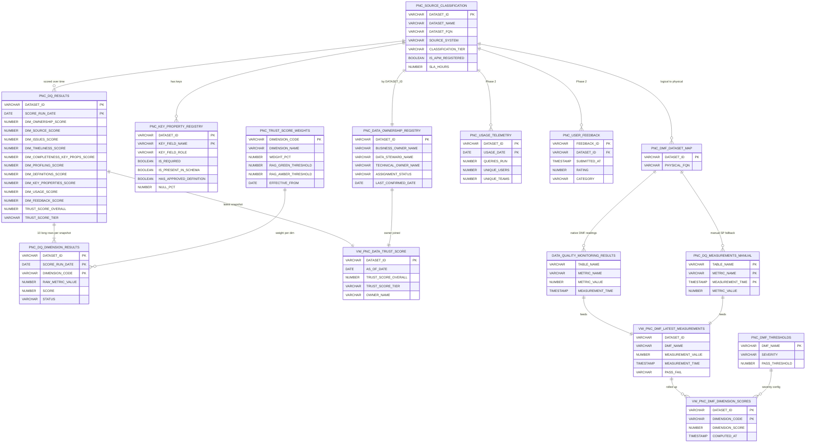

# Unified Data Trust Score — Enterprise Model

> Companion to the Discovery Opportunity Brief (`01a_Discovery_Opportunity_Brief_Data_Trust_Score.docx`),
> the Data Governance team's revised framework (`Data_Trust_Score_Revised_Framework.docx`),
> and — as of the **v2 finalization** — the Leadership Briefing
> (`Data_Trust_Score_Framework_Leadership_Briefing.docx`), the v2 scoring
> workbook (`Data_Trust_Score_v2_Framework_and_Scoring.xlsx`), and the
> v2 Leadership Deck (`Data_Trust_Score_Leadership_Deck_WBD.pptx`).
>
> Goal: a single, refined Trust Score model that combines the prototype's
> measurement-engine reference implementation (Snowflake + Cortex DQ) with
> the governance team's broader dimension coverage, graduated rubrics,
> and rebalanced weights. The governance framework has moved from a v1
> draft (9 dims) to a **v2 finalized recommendation (10 dims, with Data
> Quality split by accountability into Business DQ / IT Observability /
> IT Active Issues, and a new DQ Confidence Factor tied to measurement
> layer)**. This document reconciles the prototype against the v2
> framework. Both were always intended to be **domain-neutral** —
> applicable to any enterprise data domain. The synthetic data in this
> repo and the governance team's pilot both happen to use People &
> Culture datasets, but neither model bakes in P&C-specific assumptions,
> and the unified model preserves that domain-neutral intent.
>
> **v2 change summary (short version):**
> 1. Dimensions: 9 → **10** (Data Quality decomposed into `Data Quality (5 DAMA dims, Business)` + `Data Observability (IT)` + `Active Issues (IT)`).
> 2. Weights (sum = 100): DQ 22 / Observability 12 / Active Issues 5 / Ownership 12 / Source 10 / Lineage 10 / Definitions 9 / Classification, Privacy & Security **12** (raised from 8) / Usage 5 / Feedback 3.
> 3. **NEW: DQ Confidence Factor** — where DQ can't be measured at source (no end-to-end lineage yet), score the most-upstream layer available and multiply by a confidence factor: Source `1.00`, Bronze `0.90`, Silver `0.75`, Gold `0.60`.
> 4. Dimension **tiers** introduced (Quality / Foundational / Trust / Protection / Adoption) for grouping in dashboards and rubrics.
> 5. Trust bands unchanged (5 bands, Certified ≥ 90). Rubrics standardized to a stepped 0 / 25 / 50 / 75 / 100 with per-dim `Signal Source` (IDQ / Snowflake / Collibra / APM).
> 6. Explicit technology open item: **Informatica IDQ + Snowflake + Collibra** are disconnected today — recommendation is a lightweight interim scoring process now, integrated pipeline as a separate workstream.
>
> This document is the source of truth. The slide pack at the top is
> Copilot-ready bullets you can paste in to generate the working deck.

> **Naming convention.** The existing prototype's SQL files and tables
> carry a `PNC_` prefix as a historical artifact from the initial scoping
> exercise. **The unified enterprise model in this document uses clean,
> unprefixed names** (e.g. `DATA_OWNERSHIP_REGISTRY`, not
> `PNC_DATA_OWNERSHIP_REGISTRY`) — appropriate for a domain-neutral
> enterprise rollout. Section 8 (Mapping back to this repo) intentionally
> keeps the `PNC_` prefix on the LEFT-hand "Repo artifact" column because
> those file paths exist on disk today; a full repo rename is a separate
> refactor (~30 files affected) and not part of this spec.

---

## Slide pack (paste into Copilot)

### Slide 1 — Two Trust Models on the Table (governance has landed on v2)

- Both models are intended to be domain-neutral (usable for any enterprise data domain)
- Prototype model (this repo): **10 dimensions**, weights `12 / 10 / 12 / 14 / 14 / 12 / 8 / 8 / 6 / 4`, **4 tiers** (Gold / Silver / Bronze / At-Risk), **dataset grain**, with a working measurement-engine reference implementation on Snowflake + Cortex Data Quality (POC tables only)
- Governance team's **finalized v2 framework**: **10 dimensions** (Data Quality split by accountability into Business DQ / IT Observability / IT Active Issues), weights `22 / 12 / 5 / 12 / 10 / 10 / 9 / 12 / 5 / 3`, **5 tiers** (Certified ≥ 90 / Trusted / Developing / Provisional / At Risk), **element grain** with a CDE 2× multiplier, and a **new DQ Confidence Factor** (`1.0 → 0.6`) applied by DQ measurement layer (Source / Bronze / Silver / Gold)
- Same intent — a composite 0–100 score that certifies whether a dataset is fit to publish in the enterprise Data Marketplace
- Different structure, depth, and assumed measurement engine — the unified enterprise model in this document **adopts v2 as the target framework** and re-uses the prototype's Cortex DQ plumbing as the reference measurement engine for the three IT-owned quality dimensions

### Slide 2 — Pros of the Governance v2 Framework

- Removes the quality duplication baked into the prototype (Profiling + Timeliness + Completeness collapsed into one DAMA-aligned Data Quality dimension at weight 22)
- **DQ split by accountability** — Business DQ (5 DAMA dims, 22 pts) vs. IT Observability (12 pts, freshness/volume/schema/pipeline) vs. IT Active Issues (5 pts, open P1/P2 + SLA breaches). Different owners act on different failures.
- Adds **Data Lineage** as a foundational pillar — every enterprise trust-score standard names lineage core; the prototype omitted it
- **Source is graduated** (APM-registered ≠ Certified system of truth) — far more honest signal than the prototype's near-binary check
- Ownership broadened from owner-only to **Owner + Steward + Custodian** — reflects how accountability actually works in the enterprise
- **CDE as a 2× multiplier**, not a flat dimension — non-critical fields are never unfairly penalized
- **"Foundational" warning replaces hard gates** — the scorecard remains usable while still flagging risk
- **Classification, Privacy & Security raised to 12** — direct regulatory exposure (GDPR / CCPA); an explicit "No" earns full credit (only blank penalized)
- **NEW: DQ Confidence Factor** — teams that measure at source score higher; datasets with lineage gaps aren't blocked, they get a discounted-but-honest score. Creates an organic incentive to build out end-to-end lineage.
- Element-grain scoring exposes which columns are dragging a dataset down — more actionable than dataset-grain alone
- Five-band structure with **Certified ≥ 90** aligns with the marketplace certification language already in use

### Slide 3 — Prototype Design Choices Worth Keeping in the Unified Model

- The prototype has a **working measurement-engine reference implementation** on Snowflake + Cortex DQ (15 DMFs attached to the POC Workday tables) — demonstrates the three IT-owned quality dimensions (Data Quality, Observability, Active Issues) can be delivered without standing up a second platform. The v2 leadership deck flags this as a critical open item since IDQ / Snowflake / Collibra are not integrated today.
- Element-grain scoring will swamp the existing Streamlit UI — dataset-grain reporting matches how stakeholders consume scores (the unified model keeps element-grain *scoring* with dataset-default *reporting*, drill-down to element)
- The prototype's separate **Active Issues** dimension is preserved in v2 (5 pts) — a healthy DAMA pass rate can still mask a screaming P1
- Pilot scores of 15.7 and 22.9 (At Risk) with a "measurable ceiling" of 41 / 100 will read as **a broken model** to non-governance audiences without careful framing — the leadership deck's *"low scores are about coverage, not the model"* framing is the required narrative on every dashboard surface
- **"Blanks = 0"** is correct in principle but unforgiving for any first-time scoring — it needs a paired "measurable ceiling" disclosure, otherwise every new dataset looks At Risk on day one

### Slide 4 — Proposed Unified Enterprise Model (v2 finalized — 10 dims, weights = 100)

- Adopt the **v2 10-dimension structure** (dimension | tier | owner | wt):
  1. Data Quality (5 DAMA dims) | Quality | Business | **22**
  2. Data Observability | Quality | IT | **12**
  3. Active Issues | Quality | IT | **5**
  4. Ownership & Stewardship | Foundational | Both | **12**
  5. Authoritative Source & Certification | Foundational | Both | **10**
  6. Data Lineage | Foundational | IT | **10**
  7. Business Definitions / Glossary | Trust | Business | **9**
  8. Classification, Privacy & Security | Protection | Both | **12**
  9. Usage | Adoption | Both | **5**
  10. User Feedback | Adoption | Business | **3**
- Adopt the **CDE 2× multiplier** (configurable, stored on `TRUST_SCORE_WEIGHTS.CDE_MULTIPLIER`)
- Adopt the **DQ Confidence Factor**: `Effective DQ score = DQ rubric × Confidence Factor × Weight (22)`, where confidence factor is `1.00` at source, `0.90` Bronze, `0.75` Silver, `0.60` Gold — captured per-dataset on `DMF_DATASET_MAP.DQ_MEASUREMENT_LAYER`
- Keep the **Foundational warning flag** mechanic (Ownership / Source / Lineage average < 50% surfaces a "review before publishing" banner — no hard block)
- Keep **"blanks = 0"** with a **mandatory "measurable ceiling" disclosure** on every dashboard surface
- Adopt the **5-band tier structure** (Certified ≥ 90 / Trusted 75–89 / Developing 60–74 / Provisional 40–59 / At Risk < 40) for marketplace alignment
- **Reporting grain**: score at element level, report at dataset level by default, drill down to element on the detail page
- **Measurement engine (v2 open item)**: v2's target signal sources are **Informatica IDQ** (DQ + Observability), **Snowflake** (Observability signals + native DMFs), **Collibra** (Ownership / Source / Lineage / Definitions / Classification). These three systems are **not integrated today**. Recommended path: (a) stand up a lightweight interim scoring process (this repo's Snowflake + Cortex DQ plumbing is a working reference for the three IT-owned quality dims), and (b) design the long-term integrated pipeline as a separate workstream.

### Slide 5 — Decisions Needed to Lock the Enterprise Model

- Sign off on the **v2 rebalanced weights** and the CDE multiplier value (both editable in the v2 workbook and in `TRUST_SCORE_WEIGHTS` — no code change to retune)
- Confirm the **5-tier band structure** and the Certified ≥ 90 threshold
- Confirm **dataset-default / element-drill-down** reporting grain
- Approve the **DQ Confidence Factor mechanic** and the four layer values (`1.00 / 0.90 / 0.75 / 0.60`)
- Name the **owner of the score definition** and the change-management workflow for weights/rubrics over time
- Confirm the **technology path**: interim manual/semi-automated scoring first, integrated IDQ + Snowflake + Collibra pipeline as a separate workstream — decision needed on who owns the interim build, on what timeline and budget
- Identify the **source-of-truth system for the IT Data Custodian role** so Ownership can reach full credit (today's metadata caps it at 50%)
- Confirm the **DQ Measurement Layer** for the pilot datasets (which pipeline layer — Bronze / Silver / Gold — do current DQ rules target?) and the Authoritative Source certification level for the P&C staging views (defaulted to 25% pending confirmation)

---

## 1. Side-by-side dimension mapping

The prototype's 10 → governance v1's 9 → **v2's finalized 10 dimensions**.
Weights shown under each. Cells that say *(folds into …)* indicate the
prototype dim is merged into the named unified dim rather than dropped.
The v2 finalized column also carries a **Tier** (Quality / Foundational
/ Trust / Protection / Adoption) used for dashboard grouping, and the
**Owner** (Business / IT / Both) used to route DQ signals to the right
accountability party.

| Prototype dim (current) | Wt | Governance v1 dim | Wt | Unified v2 dim | Tier | Owner | Wt |
|---|---:|---|---:|---|---|---|---:|
| Data Profiling | 12 | *(folded into Data Quality)* | — | **Data Quality** (5 DAMA dims) — Completeness, Accuracy, Consistency, Validity, Uniqueness | Quality | Business | **22** |
| Completeness of Key Properties | 14 | *(folded into Data Quality)* | — | ↳ via DMF `SNOWFLAKE.CORE.NULL_PERCENT(<key cols>)` — **DQ score × Confidence Factor** (see § 2.1) | — | — | — |
| Timeliness | 14 | *(folded into Data Quality)* | 30 (v1 combined) | **Data Observability** — Freshness / Volume / Schema / Pipeline health *(new in v2 — carved out of DQ so IT owns it)* | Quality | IT | **12** |
| Active Issues | 12 | Data Observability / Active Issues | 7 | **Active Issues** — Open P1/P2, SLA breaches, pipeline failures *(v2 keeps this distinct from Observability — a healthy Obs score can still mask a P1)* | Quality | IT | **5** |
| Data Ownership | 12 | Ownership & Stewardship | 12 | **Ownership & Stewardship** (Owner + Steward + Custodian) | Foundational | Both | **12** |
| Data Source | 10 | Authoritative Source & Certification | 10 | **Authoritative Source & Certification** (graduated 5-step) | Foundational | Both | **10** |
| *(not present)* | — | **Data Lineage** *(NEW in v1)* | 10 | **Data Lineage** (none / partial / substantial / full end-to-end) | Foundational | IT | **10** |
| Data Definitions | 8 | Business Definitions / Glossary | 11 | **Business Definitions / Glossary** | Trust | Business | **9** |
| Key Properties | 8 | *(folded into Classification + CDE flag)* | — | *(repurposed: `DATA_ELEMENT_REGISTRY` drives `IS_CDE` flag at element grain)* | — | — | — |
| *(not present)* | — | Classification, Privacy & Security *(NEW in v1)* | 8 | **Classification, Privacy & Security** — 4 determinations; explicit "No" = full credit *(v2 raised weight to reflect GDPR / CCPA regulatory exposure)* | Protection | Both | **12** |
| Usage | 6 | Usage | 8 | **Usage** (thresholded: 0 / 1–5 / 5–10 / 10+ teams) | Adoption | Both | **5** |
| User Feedback | 4 | User Feedback | 4 | **User Feedback** (structured survey / catalog rating) | Adoption | Business | **3** |
| **TOTAL** | **100** | **TOTAL** | **100** | **TOTAL** | — | — | **100** |

Plus, for the unified v2 model: **CDE Criticality Multiplier = 2.0**
(editable) applied in the element → dataset roll-up, and the **DQ
Confidence Factor** (`1.00 / 0.90 / 0.75 / 0.60` for Source / Bronze /
Silver / Gold measurement layers) applied inline to the Data Quality
dimension score.

---

## 2. Per-dimension rubric

v2 uses a **stepped 0 / 25 / 50 / 75 / 100 rubric** with a documented
`Signal Source` per dimension (IDQ / Snowflake / Collibra / APM). This
document adopts that stepped rubric as the specification. Where the
prototype already has DMF / Cortex DQ evidence, the same 0/25/50/75/100
scale is computed **continuously** from the underlying measurement (via
Cortex DQ pass rates) — the stepped rubric documents the fallback and
the intent, while the automated pipeline can return a continuous number
inside that scale.

### 2.0 DQ Confidence Factor (applies to dimension 1 only)

The **DQ Confidence Factor** captures the reality that most datasets
don't yet have end-to-end lineage back to a source system, so DQ rules
often run at a downstream layer (Bronze / Silver / Gold) where prior
transformations can either mask or create issues. Rather than block
those datasets, v2 scores DQ from the most-upstream layer available and
scales it down by a per-layer factor:

| Measurement layer | Confidence factor | Rationale |
|---|---:|---|
| Source system | 1.00 | Measures true source quality; no discount. |
| Bronze / Landing | 0.90 | Minimal transformation; score highly representative. |
| Silver / Cleansed | 0.75 | Cleansing applied; some issues may be masked or created. |
| Gold / Serving | 0.60 | Significant transformation; DQ signal least reliable. |

`Effective DQ score = DQ rubric score (0–1) × Confidence Factor × Weight (22)`.

Captured once per dataset on `DMF_DATASET_MAP.DQ_MEASUREMENT_LAYER` and
updated as lineage improves. The factor scales **only the Data Quality
dimension** — Observability and Active Issues are separate dimensions
with their own scores.

### 1. Data Quality (weight 22, Quality tier, Business-owned)
- **What is measured**: the 5 DAMA sub-dimensions — Completeness, Accuracy, Consistency, Validity, Uniqueness. Timeliness moved out of DQ into Data Observability.
- **Rubric**: `0` no DQ rules defined · `25` ≥ 1 DAMA sub-dim passing · `50` ~half of dims pass (2–3 of 5) · `75` most dims pass (4 of 5) · `100` all 5 DAMA sub-dims pass IDQ thresholds.
- **Confidence factor**: score is multiplied by the DQ Confidence Factor above.
- **Signal source (v2 target)**: Informatica IDQ.
- **In this repo (reference implementation)**: pass rate of attached DMFs grouped by DAMA sub-dim from `VW_DMF_DIMENSION_SCORES` (named `VW_PNC_DMF_DIMENSION_SCORES` in the existing prototype). Track A via `SNOWFLAKE.LOCAL.DATA_QUALITY_MONITORING_RESULTS` or Track B via the manual SP fallback in [ddl/25_manual_dmf_fallback.sql](ddl/25_manual_dmf_fallback.sql) — see [README.md](README.md) Appendix A.

### 2. Data Observability (weight 12, Quality tier, IT-owned) — NEW in v2
- **What is measured**: Freshness / Timeliness, Volume anomalies, Schema drift, Pipeline health, null-rate trends.
- **Rubric**: `0` no monitoring · `25` partial (1–2 of 4 signals active) · `50` monitored with known gaps; some alerts missing · `75` full monitoring, minor anomalies resolved · `100` full monitoring, all 4 signals green, no anomalies.
- **Signal source (v2 target)**: Informatica IDQ / Snowflake monitoring.
- **In this repo (reference implementation)**: `SNOWFLAKE.CORE.FRESHNESS(LOADDATE)` DMF for freshness; row-count / null-rate DMFs already wired for volume and null-trend signals. Schema drift and pipeline health remain open items — a lightweight `DATA_OBSERVABILITY_METRICS` table can capture the four signals uniformly whether they come from IDQ or from Snowflake DMFs.

### 3. Active Issues (weight 5, Quality tier, IT-owned)
- **What is measured**: Open P1/P2 incidents, SLA breaches, unresolved pipeline failures tied to the dataset.
- **Rubric**: `0` open P1 OR repeated SLA breach · `25` open P2 under investigation · `50` minor issues under investigation, no SLA breach · `75` issues resolved recently, under observation · `100` zero open incidents, SLA consistently met.
- **Override**: score = 0 if any P1 is open (v2 override logic).
- **Signal source (v2 target)**: IDQ / Incident Management system.
- **In this repo (reference implementation)**: derive from currently FAILED DMFs by severity in `VW_DMF_LATEST_MEASUREMENTS` (`VW_PNC_DMF_LATEST_MEASUREMENTS` in the existing prototype). Continuous formula for the reference implementation: `100 − (20 × open_P1 + 10 × open_P2 + 5 × open_P3)`, floored at 0, capped at 100.
- **Why kept separate from Observability**: a healthy Observability score can still mask a screaming open P1; keeping Active Issues as its own 5-pt dimension surfaces incidents even when the broader monitoring picture looks green.

### 4. Ownership & Stewardship (weight 12, Foundational tier, Both)
- **What is measured**: Data Owner, Data Steward (business), Data Custodian (IT) — all three assigned, active, and documented.
- **Rubric** (v2: 3-state, no 25/75): `0` no roles assigned · `50` 1–2 of 3 roles assigned (partial) · `100` all 3 roles assigned and active.
- **Signal source (v2 target)**: APM / Collibra.
- **In this repo (reference implementation)**: extend `DATA_OWNERSHIP_REGISTRY` with `STEWARD_NAME` / `STEWARD_EMAIL` / `CUSTODIAN_NAME` / `CUSTODIAN_EMAIL` / assignment-date columns. A role assignment older than 12 months counts as partial (0.5) for that role.
- **Today's cap**: absent Custodian source system caps most datasets at 50%.

### 5. Authoritative Source & Certification (weight 10, Foundational tier, Both)
- **What is measured**: Is this the enterprise System of Record? Has it been certified?
- **Rubric** (graduated 5-step): `0` unknown / undocumented · `25` copied / derived from unknown lineage · `50` derived from a valid SoT but not documented as authoritative · `75` identified as authoritative but not yet enterprise-certified · `100` Enterprise-Certified SoT (Gold badge in Collibra).
- **Signal source (v2 target)**: Collibra.
- **In this repo (reference implementation)**: extend `SOURCE_CLASSIFICATION` with a `CERTIFICATION_LEVEL` enum column.
- **Note**: APM registration alone never exceeds 25% — being registered isn't the same as being certified.

### 6. Data Lineage (weight 10, Foundational tier, IT-owned)
- **What is measured**: End-to-end lineage from source to consumption, including transformations.
- **Rubric** (v2: 4-state, no 25): `0` none documented · `50` partial (table-level only or major segments) · `75` substantial (minor gaps or missing transforms) · `100` full end-to-end column-level lineage including transformation logic.
- **Signal source (v2 target)**: Collibra (with IDQ → Collibra lineage export).
- **In this repo (reference implementation)**: net-new `LINEAGE_REGISTRY` — one row per dataset with a `COVERAGE_LEVEL` enum and free-text notes; later, an integration hook to lineage tooling.
- **Note**: dimension is scored even when blank — `0` is a valid signal and feeds the Foundational flag.

### 7. Business Definitions / Glossary (weight 9, Trust tier, Business-owned)
- **What is measured**: Business glossary term approved and linked to the asset.
- **Rubric** (v2: 3-state, no 25/75): `0` no glossary term linked · `50` definition present but not approved by Business · `100` approved and complete business definition linked in Collibra.
- **Signal source (v2 target)**: Collibra.
- **In this repo (reference implementation)**: the `HAS_APPROVED_DEFINITION` flag on `KEY_PROPERTY_REGISTRY` today; long-term, a Collibra glossary feed via `BUSINESS_GLOSSARY`.

### 8. Classification, Privacy & Security (weight 12, Protection tier, Both)
- **What is measured**: Four determinations — Data Classification, PII flag, Security classification, SPI flag.
- **Rubric** (presence-based, 5-step): `score = populated determinations ÷ 4 × 100`, so `0` none / `25` 1 of 4 / `50` 2 of 4 / `75` 3 of 4 / `100` all 4.
- **Critical nuance**: an explicit `"No"` counts as populated. Only a blank is penalized — "trust must be earned" applies to evidence of governance, not to the dataset being personal data.
- **Signal source (v2 target)**: Collibra / Security team.
- **In this repo (reference implementation)**: net-new `CLASSIFICATION_REGISTRY` — one row per dataset, four nullable enum columns.
- **v2 rationale for the weight raise (8 → 12)**: direct regulatory exposure (GDPR, CCPA); underweighting understated organizational risk.

### 9. Usage (weight 5, Adoption tier, Both)
- **What is measured**: Number of consuming teams tracked in data catalog.
- **Rubric**: `0` 0 teams · `50` 1–5 teams · `75` 5–10 teams · `100` 10+ teams actively consuming.
- **Signal source (v2 target)**: Data catalog usage tracking (Collibra).
- **In this repo (reference implementation)**: `USAGE_TELEMETRY` (already scaffolded as Phase 2) populated from Snowflake `ACCESS_HISTORY` or a catalog tool's consumption counts.

### 10. User Feedback (weight 3, Adoption tier, Business-owned)
- **What is measured**: Structured positive feedback from data consumers via survey or catalog rating.
- **Rubric** (v2: 3-state, no 25/75): `0` no feedback OR net-negative · `50` mixed / neutral feedback with some concerns raised · `100` positive structured feedback from multiple consumer teams.
- **Signal source (v2 target)**: Survey results / Collibra catalog ratings.
- **In this repo (reference implementation)**: `USER_FEEDBACK` (Phase 2) — in-app rating, ServiceNow tie-in, or a periodic survey. Lagging indicator, hence the lowest weight.

### CDE Criticality Multiplier (configurable, default 2.0)
- Not a dimension. A column flagged as a Critical Data Element weighs **2 ×** when element scores are rolled up to the dataset score.
- **Source of the flag**: `DATA_ELEMENT_REGISTRY.IS_CDE` (net-new column in v2). In this repo, repurpose `KEY_PROPERTY_REGISTRY` initially, then migrate to `DATA_ELEMENT_REGISTRY`.
- **Non-CDE columns are scored normally and are never penalized for not being critical.**
- **Multiplier value** is stored centrally on `TRUST_SCORE_WEIGHTS.CDE_MULTIPLIER` and is retunable without a code change.

---

## 3. Trust band definitions (5 bands)

| Band | Score | Marketplace guidance |
|---|---:|---|
| Certified | 90–100 | Publishable to the enterprise Data Marketplace. Production-grade; approved for decision-critical use. |
| Trusted | 75–89 | Publishable with notes. Reliable for most analytics; review the dimension detail for high-stakes use. |
| Developing | 60–74 | Internal / conditional use. Meaningful gaps; not yet marketplace-certified. |
| Provisional | 40–59 | Exploratory only. Significant gaps across foundational or quality dimensions. |
| At Risk | 0–39 | Not for decision-making until gaps close and foundational dimensions are met. |

Migration note: today's 4-tier (Gold ≥ 85 / Silver ≥ 70 / Bronze ≥ 50 /
At-Risk < 50) maps to the new bands as follows — Gold → Certified or
Trusted (depending on whether the dataset clears 90), Silver → Trusted or
Developing, Bronze → Developing or Provisional, At-Risk → Provisional or
At Risk. We expect roughly a one-tier shift downward for most datasets
under the new thresholds.

---

## 4. Element → Dataset roll-up (formula + worked example)

### Formula

For each data element (column) `e` of dataset `D`:

```
element_score(e) = Σ_dim (effective_dim_score(e, dim) × weight(dim))
                   where dim_score ∈ [0, 1] and Σ weight = 100
                   ⇒ element_score ∈ [0, 100]

effective_dim_score(e, dim) =
    dim_score(e, dim) × DQ_confidence_factor(D)   if dim = Data Quality
    dim_score(e, dim)                             otherwise

DQ_confidence_factor(D) = lookup on DMF_DATASET_MAP.DQ_MEASUREMENT_LAYER
    Source  → 1.00
    Bronze  → 0.90
    Silver  → 0.75
    Gold    → 0.60

dataset_score(D) = Σ_e (element_score(e) × criticality(e))
                   ÷ Σ_e criticality(e)

criticality(e) = CDE_MULTIPLIER if e.IS_CDE else 1.0   (default CDE_MULTIPLIER = 2.0,
                                                       stored on TRUST_SCORE_WEIGHTS)
```

### Worked example

Suppose dataset `D` has three elements. Assume the simplified per-element
scores below (already weighted across all 10 dims and with the DQ
Confidence Factor applied to the DQ dimension, so each column is a
single 0–100 number):

| Element | element_score | IS_CDE | weight in roll-up |
|---|---:|---|---:|
| `position_id` | 80 | Yes | 2.0 |
| `worker_email` | 60 | No | 1.0 |
| `comment_text` | 30 | No | 1.0 |

```
numerator   = (80 × 2.0) + (60 × 1.0) + (30 × 1.0) = 160 + 60 + 30 = 250
denominator = 2.0 + 1.0 + 1.0 = 4.0
dataset_score = 250 / 4 = 62.5  →  Developing
```

If instead `comment_text` were also flagged CDE (multiplier 2.0), the
denominator would rise to 5.0 and the dataset_score would fall to
`(160 + 60 + 60) / 5 = 56`, dropping the dataset from Developing into
Provisional. This is the intended behaviour: marking more columns
critical raises the bar.

### Worked example — DQ Confidence Factor effect

Suppose `position_id` above achieved a **raw DQ rubric score of 1.0**
(all 5 DAMA sub-dims passing), so its DQ contribution before the factor
is `1.0 × 22 = 22 points`.

- If DQ is measured **at source**: `1.0 × 1.00 × 22 = 22 points` — full credit.
- Measured at **Bronze**: `1.0 × 0.90 × 22 = 19.8 points`.
- Measured at **Silver**: `1.0 × 0.75 × 22 = 16.5 points`.
- Measured at **Gold** (most common today): `1.0 × 0.60 × 22 = 13.2 points`.

That 8.8-point swing between Source and Gold measurement is the built-in
incentive to move DQ measurement upstream over time. The dataset isn't
blocked from being scored — it just doesn't get full credit until the
evidence pipeline reaches source. The factor is captured once per
dataset on `DMF_DATASET_MAP.DQ_MEASUREMENT_LAYER` and updated as lineage
improves.

---

## 5. Foundational-flag mechanic

The three **Foundational** dimensions are **Ownership & Stewardship**,
**Authoritative Source**, and **Data Lineage**. A dataset surfaces a
`Foundational gap` flag — a yellow warning, not a hard block — when:

```
mean(dim_score(D, Ownership),
     dim_score(D, Source),
     dim_score(D, Lineage)) < 0.5    (i.e. < 50%)
```

UI behaviour:

- The flag renders inline on the Portfolio Scorecard tier pill and at the
  top of the Dataset Detail page with the text
  *"Foundational gap — review Ownership / Source / Lineage before publishing."*
- The flag never affects the numeric score itself. A dataset can still be
  Trusted or Certified by overall score and still carry the flag (rare in
  practice, by design — usually the foundational gap drags the score down
  anyway).
- **This is the key difference from the prototype's original "gates"**:
  the prototype's gates produced an automatic At-Risk tier regardless of
  the rest of the score. That was too blunt — it stopped governance from
  seeing where else the dataset was strong.

---

## 6. "Blanks = 0" stance + measurable ceiling disclosure

We adopt the governance team's stance: **a dimension with no evidence
today scores 0.** Trust must be earned; absence of evidence is not
evidence of trustworthiness.

This is honest but harsh — a brand-new dataset, or any dataset whose
evidence-supplying systems aren't online yet, will score very low on day
one. To prevent this from being misread as a model defect, **every
dashboard surface displaying a Trust Score MUST also display the
dataset's measurable ceiling.**

### Measurable ceiling — definition

```
measurable_ceiling(D) =
    Σ_dim weight(dim)  for every dim where evidence is currently captured
                        for dataset D (i.e. the source table/view/registry
                        exists AND has at least one populated row for D)
```

For example, if today only Ownership, Source, Definitions and Classification
have evidence for a dataset, the ceiling is `12 + 10 + 10 + 8 = 40` — no
matter how good the dataset is, it cannot exceed 40 / 100 until the other
five dimensions' evidence pipelines are stood up.

### Required disclosure

- Portfolio Scorecard: ceiling shown as a faint outline behind the score bar.
- Dataset Detail: ceiling shown as a metric next to the headline score, with the explanatory text *"Closing this gap is the roadmap to a Certified, marketplace-ready dataset."*
- Methodology page: dedicated section explaining the ceiling concept with a worked example.

---

## 7. Pilot findings interpretation (the 15.7 / 22.9 / ceiling = 41 story)

The v2 pilot re-applied the framework to the two supplied P&C staging
views and surfaced scores of **15.7** (At Risk) for
`STG_POSITION_REPORT_VW` and **22.9** (At Risk) for
`STG_TRENDED_REPORT_VW`, with a **measurable ceiling of 41 / 100**.

Read at face value, those numbers look catastrophic. They aren't. They
are a **coverage finding, not a model defect.** The leadership deck's
required framing: *"the low scores are about coverage, not the model.
Only Ownership, Source, Definitions and Classification carry any signal
today. The other six dimensions (59 of 100 points) aren't captured yet.
Close that gap and these datasets can reach Certified."*

Today, only four of the ten unified dimensions have any evidence
available for those staging views:

- Ownership (capped at 50% — no IT Data Custodian named)
- Authoritative Source (capped at 25% — no certified-SoT determination)
- Business Definitions (mixed — some elements documented, most not)
- Classification (mixed — some PII determinations present, most absent)

The remaining six dimensions — Data Quality, Data Observability, Active
Issues, Data Lineage, Usage, User Feedback — contribute **0** to the
score because the evidence pipelines that would feed them don't yet
exist for these datasets. That 0 is a true signal under the "trust must
be earned" stance, and it caps the achievable score at the ceiling.

**The v2 Roadmap to Certified — priority-ordered from the v2 workbook**,
mapped to the unified 10-dim weights and the source system that needs
to stand up (or connect):

| Priority | Dimension | Wt | Points to unlock | Current state → Target state | Source system |
|---:|---|---:|---:|---|---|
| 1 | Data Quality (5 DAMA) | 22 | 22 (×DQ Confidence Factor) | No IDQ rules defined → all 5 DAMA dims passing at source | Informatica IDQ *(disconnected — open item; Cortex DQ reference implementation in this repo)* |
| 2 | Data Lineage | 10 | 10 | No lineage documented → full end-to-end column-level lineage | Collibra / IDQ *(disconnected — open item)* |
| 3 | Data Observability | 12 | 12 | No monitoring on freshness/volume/schema/pipeline → all 4 signals monitored with alerting | IDQ / Snowflake *(disconnected — open item)* |
| 4 | Classification, Privacy & Security | 12 | ~9 | Partial determinations; many blank → all 4 populated per element | Collibra / Security team |
| 5 | Ownership & Stewardship | 12 | 6 | Partial: no Custodian assigned → all 3 roles assigned & active | APM / Collibra |
| 6 | Authoritative Source | 10 | 7.5 | Derived from valid SoT but not certified → Enterprise-Certified Gold badge | Collibra |
| 7 | Business Definitions | 9 | ~2 | Definitions present but not approved → approved & complete for all key elements | Collibra |
| 8 | Active Issues | 5 | 5 | No active incident tracking tied to data assets → zero open, SLA met, tracking connected | IDQ / Incident Management |
| 9 | Usage | 5 | 5 | 0 teams tracked → 5–10+ teams actively consuming, tracked in catalog | Data catalog (Collibra) |
| 10 | User Feedback | 3 | 3 | No structured feedback → positive structured feedback from multiple teams | Survey / Collibra ratings |
| **TOTAL** | | **100** | **~78** | Earned today ≈ 22 → Certified ≥ 90 | 3 disconnected systems (v2 open item) |

The single largest unlock is the Data Quality dimension (22 points, times
the Confidence Factor). The prototype's existing Cortex DQ setup against
`DT_POSITION_REPORT` and `DT_TRENDED_REPORT` is the working blueprint
for closing that gap on any other dataset while the long-term Informatica
IDQ ↔ Collibra ↔ Snowflake pipeline is designed.

---

## 8. Mapping the unified model back to this repo

Read-only summary of what would need to change when (not if) the unified
model is approved for implementation. **No changes are made in this
document** — implementation deferred to a follow-up pass.

> **Note on naming**: this table intentionally keeps the existing
> prototype's `PNC_` prefix on the LEFT-hand "Repo artifact" column
> because those file paths exist on disk today. The unified enterprise
> model itself (sections 2–7 and the data models in section 9) uses
> unprefixed names. A full repo rename to drop the `PNC_` prefix
> everywhere is a separate refactor (~30 files affected) that can be
> tackled after the model is signed off.

| Repo artifact | Change required | Net effect |
|---|---|---|
| [ddl/seed/91a_seed_pnc_trust_score_weights.sql](ddl/seed/91a_seed_pnc_trust_score_weights.sql) | Replace 10 rows with the **v2 10 dimension codes and weights** (`DATA_QUALITY 22 / OBSERVABILITY 12 / ACTIVE_ISSUES 5 / OWNERSHIP 12 / SOURCE 10 / LINEAGE 10 / DEFINITIONS 9 / CLASSIFICATION 12 / USAGE 5 / FEEDBACK 3`); add `DIMENSION_TIER` column (Quality / Foundational / Trust / Protection / Adoption) and `DIMENSION_OWNER` column (Business / IT / Both); add a row (or column on every row) capturing the CDE multiplier value | Retunable later without code; the table is the source of truth for weights, tiers, owners, and the CDE multiplier |
| **NEW** `ddl/seed/91b_seed_dq_confidence_factor.sql` | Net-new lookup — 4 rows (`SOURCE 1.00 / BRONZE 0.90 / SILVER 0.75 / GOLD 0.60`) supplying the DQ Confidence Factor mechanic | Retunable factor without code |
| [ddl/01_pnc_dq_results_extended.sql](ddl/01_pnc_dq_results_extended.sql) | Drop `DIM_PROFILING_SCORE`, `DIM_COMPLETENESS_KEY_PROPS_SCORE`, `DIM_KEY_PROPERTIES_SCORE`; add `DIM_DATA_QUALITY_SCORE` (5 DAMA dims), `DIM_OBSERVABILITY_SCORE`, `DIM_ACTIVE_ISSUES_SCORE`, `DIM_LINEAGE_SCORE`, `DIM_CLASSIFICATION_SCORE`; add `DQ_CONFIDENCE_FACTOR_APPLIED`, `MEASURABLE_CEILING`, `FOUNDATIONAL_GAP_FLAG` columns | Fact table aligned with the 10-dim v2 model + Confidence Factor evidence |
| [ddl/02_pnc_dq_dimension_results.sql](ddl/02_pnc_dq_dimension_results.sql) | Same column rename / add for the long-format companion fact; add `DIMENSION_TIER` for grouping and `EFFECTIVE_SCORE` (post-Confidence-Factor for DQ) | Trend charts work with the new 10 dim codes and can group by tier |
| [ddl/03_pnc_data_ownership_registry.sql](ddl/03_pnc_data_ownership_registry.sql) | Add `STEWARD_NAME`, `STEWARD_EMAIL`, `CUSTODIAN_NAME`, `CUSTODIAN_EMAIL`, `STEWARD_ASSIGNED_DATE`, `CUSTODIAN_ASSIGNED_DATE` columns | Captures the 3-role model |
| [ddl/04_pnc_source_classification.sql](ddl/04_pnc_source_classification.sql) | Add `CERTIFICATION_LEVEL` enum column (`UNKNOWN / COPIED / DERIVED / AUTHORITATIVE / CERTIFIED`) | Drives the graduated source rubric |
| [ddl/05_pnc_key_property_registry.sql](ddl/05_pnc_key_property_registry.sql) | Add boolean `IS_CDE` column (defaults to the existing `IS_REQUIRED` value if unspecified) — long-term migrate to a proper `DATA_ELEMENT_REGISTRY` | Feeds the element-level CDE multiplier |
| [ddl/21_pnc_dmf_dataset_map.sql](ddl/21_pnc_dmf_dataset_map.sql) (on `mvp_dmf` branch) | Add `DQ_MEASUREMENT_LAYER` enum column (`SOURCE / BRONZE / SILVER / GOLD`) — one value per dataset; joins to the new confidence-factor lookup for the multiplier | Wires the DQ Confidence Factor mechanic into the existing Cortex DQ plumbing |
| **NEW** `ddl/08_pnc_lineage_registry.sql` | Net-new table — one row per (dataset_id, lineage_coverage) capturing `NONE / PARTIAL / SUBSTANTIAL / FULL` | Supplies the Lineage dimension |
| **NEW** `ddl/09_pnc_classification_registry.sql` | Net-new table — one row per dataset, four nullable enum columns (`DATA_CLASSIFICATION`, `PII`, `SECURITY`, `SPI`) | Supplies the Classification dimension |
| **NEW** `ddl/26_pnc_data_observability_metrics.sql` | Net-new table capturing the four v2 Observability signals uniformly (`FRESHNESS`, `VOLUME`, `SCHEMA_DRIFT`, `PIPELINE_HEALTH`) per (dataset_id, measurement_time) — feeds the Observability dimension | Supplies the Observability dimension whether signals come from IDQ, Snowflake native DMFs, or a mix |
| [ddl/10_vw_pnc_data_trust_score.sql](ddl/10_vw_pnc_data_trust_score.sql) | Update tier-mapping CASE to the 5-band thresholds; surface `MEASURABLE_CEILING`, `FOUNDATIONAL_GAP_FLAG`, and `DQ_MEASUREMENT_LAYER` | Consumer view reflects the new model + Confidence Factor context |
| [app/shared.py](app/shared.py) | Update `DIMENSIONS` list to the **10 v2** codes and add tier / owner metadata; extend `TIER_COLOR` to the 5 bands; rewrite `tier_color_for()` for the new thresholds; add DQ Confidence Factor lookup dictionary | App constants aligned with v2 |
| [app/trust_score_app.py](app/trust_score_app.py) | Methodology page rewrite; portfolio heatmap column update (10 columns, grouped by tier); add measurable-ceiling rendering; add foundational-gap flag pill; add DQ Confidence Factor badge next to the DQ column | UI surfaces the v2 model incl. Confidence Factor |
| [synthetic/generate_synthetic.py](synthetic/generate_synthetic.py) | Regenerate sample data with the 10 new dim columns, populated registries for the new dims, and per-dataset `DQ_MEASUREMENT_LAYER` values (mix of Source / Bronze / Silver / Gold across datasets so the Confidence Factor mechanic is visible in the local UI) | Local-dev experience still works and now demonstrates the Confidence Factor mechanic end-to-end |
| [README.md](README.md) | Update the 10-dim section to reflect the **v2** dim names + weights; replace the tier thresholds; link to this doc and to the v2 leadership deck / briefing | Single source of truth retained |

**Effort estimate (rough)**: the SQL changes are mechanical (~1–1.5 days,
slightly longer than before because of the DQ split and the new
Observability table); synthetic regeneration + app/Methodology page
rewrite is the bulk of the work (~2–3 days); registry-seed conversations
with governance for the new Lineage / Classification / Observability
tables are the actual long pole — and per the v2 leadership deck open
item, are gated on the IDQ / Snowflake / Collibra integration decision.

---

## 9. Data models (current, governance, unified)

Three entity-relationship diagrams showing the table-level shape of each
model side by side. Rendered inline with Mermaid; the same DSL is what
`diagram_create` would push to Miro in a follow-up pass (the Miro MCP's
`diagram_create` accepts Mermaid `entity_relationship` notation
directly).

Each diagram trims audit columns (`LOAD_DATE`, `CREATED_AT`, etc.) for
readability. Full column lists live in the prototype DDL files
(referenced under Data Model A) or, for the unified model, are
specified per dimension in section 2.

### Data Model A — Current Prototype (as-is in this repo)

What lives in `ASATTAR_TRUST_SCORE_POC.DQ_POC` today. The `PNC_` prefix
is preserved because these are the actual table names on disk. The
Cortex DQ / DMF measurement layer (currently on the `mvp_dmf` branch) is
included as the planned measurement engine for dimensions 3, 4, 5, 6.



**Key shape characteristics**:
- **Grain**: dataset-level (1 row per `(DATASET_ID, SCORE_RUN_DATE)` in `PNC_DQ_RESULTS`)
- **10 dimension columns baked into the wide fact**, mirrored as 10 long rows per snapshot in the companion `PNC_DQ_DIMENSION_RESULTS`
- **No explicit `DATASET` registry** — `PNC_SOURCE_CLASSIFICATION` plays that role implicitly via the `DATASET_ID` PK
- **Per-rule output lives in the Cortex DQ measurement layer** (`VW_PNC_DMF_LATEST_MEASUREMENTS` / `VW_PNC_DMF_DIMENSION_SCORES`) — the wide fact stores aggregated scores only
- **CDE not modelled**; the closest proxy is `IS_REQUIRED` on `PNC_KEY_PROPERTY_REGISTRY`

---

### Data Model B — Governance Team's Revised Model

Inferred from the framework workbook (`Data_Trust_Score_Framework_and_Scoring.xlsx`)
and the revised framework docx. Element-grain scoring; 9 dimensions; CDE
multiplier as a column attribute, not a dimension. The governance team
hasn't published DDL, so this is the conceptual data model implied by
their per-element / per-dimension score matrix and rubric.

```mermaid
erDiagram
    DATASET_REGISTRY ||--o| OWNERSHIP_STEWARDSHIP_REGISTRY : "owner + steward + custodian"
    DATASET_REGISTRY ||--o| SOURCE_CERTIFICATION_REGISTRY : "graduated source"
    DATASET_REGISTRY ||--o| LINEAGE_REGISTRY : "graduated lineage"
    DATASET_REGISTRY ||--o| CLASSIFICATION_REGISTRY : "4 determinations"
    DATASET_REGISTRY ||--o{ DATA_ELEMENT : "columns"

    DATA_ELEMENT ||--o| BUSINESS_GLOSSARY : "definition"
    DATA_ELEMENT ||--o{ ELEMENT_DIMENSION_SCORE : "scored on 9 dims"
    DATA_ELEMENT ||--o{ DQ_RULE_RESULT : "DAMA 6 sub-dim measurements"

    DIMENSION_WEIGHTS ||--o{ ELEMENT_DIMENSION_SCORE : "weight per dim"
    TRUST_BANDS ||--o{ DATASET_TRUST_SCORE : "band lookup"

    ELEMENT_DIMENSION_SCORE ||--o{ DATASET_TRUST_SCORE : "rolled up via CDE multiplier"
    DATASET_REGISTRY ||--o{ DATASET_TRUST_SCORE : "computed per snapshot"

    DATASET_REGISTRY ||--o{ OBSERVABILITY_INCIDENT : "open or closed"
    DATASET_REGISTRY ||--o{ USAGE_METRICS : "team count"
    DATASET_REGISTRY ||--o{ USER_FEEDBACK : "rating"

    DATASET_REGISTRY {
        VARCHAR DATASET_ID PK
        VARCHAR DATASET_NAME
        VARCHAR DOMAIN
        VARCHAR MARKETPLACE_STATUS
    }
    DATA_ELEMENT {
        VARCHAR DATASET_ID PK
        VARCHAR ELEMENT_NAME PK
        VARCHAR DATA_TYPE
        BOOLEAN IS_CDE
        NUMBER CRITICALITY_MULTIPLIER
    }
    OWNERSHIP_STEWARDSHIP_REGISTRY {
        VARCHAR DATASET_ID PK
        VARCHAR DATA_OWNER
        VARCHAR DATA_STEWARD_BUSINESS
        VARCHAR DATA_CUSTODIAN_IT
        DATE OWNER_ASSIGNED_DATE
        DATE STEWARD_ASSIGNED_DATE
        DATE CUSTODIAN_ASSIGNED_DATE
    }
    SOURCE_CERTIFICATION_REGISTRY {
        VARCHAR DATASET_ID PK
        VARCHAR SOURCE_SYSTEM
        VARCHAR CERTIFICATION_LEVEL
        BOOLEAN IS_APM_REGISTERED
    }
    LINEAGE_REGISTRY {
        VARCHAR DATASET_ID PK
        VARCHAR COVERAGE_LEVEL
        TEXT LINEAGE_NOTES
    }
    CLASSIFICATION_REGISTRY {
        VARCHAR DATASET_ID PK
        VARCHAR DATA_CLASSIFICATION
        VARCHAR PII
        VARCHAR SECURITY
        VARCHAR SPI
    }
    BUSINESS_GLOSSARY {
        VARCHAR GLOSSARY_TERM_ID PK
        VARCHAR DATASET_ID FK
        VARCHAR ELEMENT_NAME FK
        VARCHAR DEFINITION_STATUS
        TEXT DEFINITION_TEXT
    }
    DIMENSION_WEIGHTS {
        VARCHAR DIMENSION_CODE PK
        VARCHAR DIMENSION_NAME
        NUMBER WEIGHT_PCT
    }
    TRUST_BANDS {
        VARCHAR BAND_NAME PK
        NUMBER MIN_SCORE
        NUMBER MAX_SCORE
        TEXT MARKETPLACE_GUIDANCE
    }
    ELEMENT_DIMENSION_SCORE {
        VARCHAR DATASET_ID PK
        VARCHAR ELEMENT_NAME PK
        VARCHAR DIMENSION_CODE PK
        DATE SCORE_RUN_DATE PK
        NUMBER DIMENSION_SCORE
    }
    DQ_RULE_RESULT {
        VARCHAR DATASET_ID PK
        VARCHAR ELEMENT_NAME PK
        VARCHAR RULE_ID PK
        DATE EVALUATED_AT PK
        VARCHAR DAMA_SUB_DIM
        NUMBER PASS_RATE
        VARCHAR STATUS
    }
    OBSERVABILITY_INCIDENT {
        VARCHAR INCIDENT_ID PK
        VARCHAR DATASET_ID FK
        VARCHAR SEVERITY
        VARCHAR STATE
        TIMESTAMP OPENED_AT
        TIMESTAMP CLOSED_AT
    }
    USAGE_METRICS {
        VARCHAR DATASET_ID PK
        DATE USAGE_DATE PK
        NUMBER UNIQUE_TEAMS
    }
    USER_FEEDBACK {
        VARCHAR FEEDBACK_ID PK
        VARCHAR DATASET_ID FK
        NUMBER RATING
        VARCHAR FEEDBACK_TYPE
    }
    DATASET_TRUST_SCORE {
        VARCHAR DATASET_ID PK
        DATE SCORE_RUN_DATE PK
        NUMBER TRUST_SCORE
        VARCHAR TRUST_BAND
        NUMBER MEASURABLE_CEILING
        BOOLEAN FOUNDATIONAL_GAP_FLAG
    }
```



**Key shape characteristics**:
- **Grain**: element-level (1 row per `(DATASET_ID, ELEMENT_NAME, DIMENSION_CODE, SCORE_RUN_DATE)` in `ELEMENT_DIMENSION_SCORE`)
- **9 dimensions**, weights in their own `DIMENSION_WEIGHTS` table (sum = 100); CDE is an attribute on `DATA_ELEMENT`, not a dimension
- **Explicit `DATASET_REGISTRY`** as the central entity (vs. the prototype's implicit anchor)
- **Measurement engine assumed external** (Informatica IDQ / Collibra) — `DQ_RULE_RESULT` is the abstract receiver shape
- **`DATASET_TRUST_SCORE` is a computed roll-up** with `MEASURABLE_CEILING` and `FOUNDATIONAL_GAP_FLAG` as first-class columns
- **5 trust bands** in `TRUST_BANDS` (Certified / Trusted / Developing / Provisional / At Risk)

---

### Data Model C — Proposed Unified Enterprise Model (v2 finalized)

The synthesis: **v2 10-dimension structure** from governance +
measurement engine from the prototype + the refinements documented in
sections 1–8 (v2 weights, Snowflake + Cortex as the reference
measurable-dim engine while the IDQ / Snowflake / Collibra integration
is designed, registry-driven for the governance dims, element-grain
scoring with dataset-default reporting, mandatory measurable-ceiling
disclosure, **DQ Confidence Factor tied to measurement layer**, and
Observability broken out as its own IT-owned dimension distinct from
both DQ and Active Issues).

```mermaid
erDiagram
    DATASET_REGISTRY ||--o| DATA_OWNERSHIP_REGISTRY : "owner + steward + custodian"
    DATASET_REGISTRY ||--o| SOURCE_CLASSIFICATION : "graduated source"
    DATASET_REGISTRY ||--o| LINEAGE_REGISTRY : "graduated lineage"
    DATASET_REGISTRY ||--o| CLASSIFICATION_REGISTRY : "4 determinations"
    DATASET_REGISTRY ||--o{ DATA_ELEMENT_REGISTRY : "columns"

    DATA_ELEMENT_REGISTRY ||--o| BUSINESS_GLOSSARY : "definition"

    DATASET_REGISTRY ||--o{ DMF_DATASET_MAP : "logical to physical (+ DQ measurement layer)"
    DQ_MEASUREMENT_LAYER_CONFIG ||--o{ DMF_DATASET_MAP : "confidence factor lookup"
    DMF_DATASET_MAP ||--o{ DATA_QUALITY_MEASUREMENTS : "DMF readings"
    DMF_THRESHOLDS ||--o{ DATA_QUALITY_MEASUREMENTS : "severity config"

    DATASET_REGISTRY ||--o{ DATA_OBSERVABILITY_METRICS : "4 signals (freshness/volume/schema/pipeline)"
    DATASET_REGISTRY ||--o{ OBSERVABILITY_INCIDENT : "open P1/P2 + SLA breaches"
    DATA_QUALITY_MEASUREMENTS ||--o{ OBSERVABILITY_INCIDENT : "derived from FAILED DMFs"

    DATASET_REGISTRY ||--o{ USAGE_TELEMETRY : "consumption counts"
    DATASET_REGISTRY ||--o{ USER_FEEDBACK : "ratings"

    TRUST_SCORE_WEIGHTS ||--o{ ELEMENT_DIMENSION_SCORE : "weight + tier + owner per dim"
    DATA_ELEMENT_REGISTRY ||--o{ ELEMENT_DIMENSION_SCORE : "scored on 10 v2 dims"
    DATA_QUALITY_MEASUREMENTS ||--o{ ELEMENT_DIMENSION_SCORE : "feeds Data Quality dim (× Confidence Factor)"
    DATA_OBSERVABILITY_METRICS ||--o{ ELEMENT_DIMENSION_SCORE : "feeds Data Observability dim"
    OBSERVABILITY_INCIDENT ||--o{ ELEMENT_DIMENSION_SCORE : "feeds Active Issues dim"

    ELEMENT_DIMENSION_SCORE ||--o{ DATASET_TRUST_SCORE : "rolled up via CDE multiplier"
    TRUST_BANDS ||--o{ DATASET_TRUST_SCORE : "band lookup"

    DATASET_TRUST_SCORE ||--|| VW_DATA_TRUST_SCORE : "latest snapshot"
    DATA_OWNERSHIP_REGISTRY ||--|| VW_DATA_TRUST_SCORE : "owner joined"

    DATASET_REGISTRY {
        VARCHAR DATASET_ID PK
        VARCHAR DATASET_NAME
        VARCHAR DATASET_FQN
        VARCHAR DOMAIN
        VARCHAR LAYER
        VARCHAR MARKETPLACE_STATUS
    }
    DATA_ELEMENT_REGISTRY {
        VARCHAR DATASET_ID PK
        VARCHAR ELEMENT_NAME PK
        VARCHAR DATA_TYPE
        BOOLEAN IS_KEY_PROPERTY
        BOOLEAN IS_CDE
    }
    DATA_OWNERSHIP_REGISTRY {
        VARCHAR DATASET_ID PK
        VARCHAR OWNER_NAME
        VARCHAR OWNER_EMAIL
        VARCHAR STEWARD_NAME
        VARCHAR STEWARD_EMAIL
        VARCHAR CUSTODIAN_NAME
        VARCHAR CUSTODIAN_EMAIL
        DATE STEWARD_ASSIGNED_DATE
        DATE CUSTODIAN_ASSIGNED_DATE
    }
    SOURCE_CLASSIFICATION {
        VARCHAR DATASET_ID PK
        VARCHAR SOURCE_SYSTEM
        VARCHAR CERTIFICATION_LEVEL
        VARCHAR LOAD_FREQUENCY
        NUMBER SLA_HOURS
    }
    LINEAGE_REGISTRY {
        VARCHAR DATASET_ID PK
        VARCHAR COVERAGE_LEVEL
        TEXT LINEAGE_NOTES
        VARCHAR LINEAGE_TOOL_REF
    }
    CLASSIFICATION_REGISTRY {
        VARCHAR DATASET_ID PK
        VARCHAR DATA_CLASSIFICATION
        VARCHAR PII
        VARCHAR SECURITY
        VARCHAR SPI
    }
    BUSINESS_GLOSSARY {
        VARCHAR GLOSSARY_TERM_ID PK
        VARCHAR DATASET_ID FK
        VARCHAR ELEMENT_NAME FK
        VARCHAR DEFINITION_STATUS
        TEXT DEFINITION_TEXT
        DATE APPROVED_DATE
    }
    DMF_DATASET_MAP {
        VARCHAR DATASET_ID PK
        VARCHAR PHYSICAL_FQN
        VARCHAR ELEMENT_NAME
        VARCHAR DQ_MEASUREMENT_LAYER
    }
    DQ_MEASUREMENT_LAYER_CONFIG {
        VARCHAR LAYER_CODE PK
        VARCHAR LAYER_NAME
        NUMBER CONFIDENCE_FACTOR
        TEXT RATIONALE
    }
    DMF_THRESHOLDS {
        VARCHAR DMF_NAME PK
        VARCHAR DAMA_SUB_DIM
        VARCHAR SEVERITY
        NUMBER PASS_THRESHOLD
    }
    DATA_QUALITY_MEASUREMENTS {
        VARCHAR DATASET_ID PK
        VARCHAR DMF_NAME PK
        TIMESTAMP MEASUREMENT_TIME PK
        NUMBER MEASUREMENT_VALUE
        VARCHAR PASS_FAIL
        VARCHAR DAMA_SUB_DIM
    }
    DATA_OBSERVABILITY_METRICS {
        VARCHAR DATASET_ID PK
        TIMESTAMP MEASUREMENT_TIME PK
        VARCHAR SIGNAL_CODE PK
        VARCHAR SIGNAL_NAME
        NUMBER SIGNAL_VALUE
        VARCHAR STATUS
        VARCHAR SIGNAL_SOURCE
    }
    OBSERVABILITY_INCIDENT {
        VARCHAR INCIDENT_ID PK
        VARCHAR DATASET_ID FK
        VARCHAR DMF_NAME FK
        VARCHAR SEVERITY
        VARCHAR STATE
        TIMESTAMP OPENED_AT
        TIMESTAMP CLOSED_AT
        BOOLEAN IS_SLA_BREACH
    }
    USAGE_TELEMETRY {
        VARCHAR DATASET_ID PK
        DATE USAGE_DATE PK
        NUMBER UNIQUE_TEAMS
        NUMBER QUERIES_RUN
    }
    USER_FEEDBACK {
        VARCHAR FEEDBACK_ID PK
        VARCHAR DATASET_ID FK
        NUMBER RATING
        VARCHAR FEEDBACK_TYPE
        TIMESTAMP SUBMITTED_AT
    }
    TRUST_SCORE_WEIGHTS {
        VARCHAR DIMENSION_CODE PK
        VARCHAR DIMENSION_NAME
        VARCHAR DIMENSION_TIER
        VARCHAR DIMENSION_OWNER
        NUMBER WEIGHT_PCT
        NUMBER CDE_MULTIPLIER
        DATE EFFECTIVE_FROM
    }
    TRUST_BANDS {
        VARCHAR BAND_NAME PK
        NUMBER MIN_SCORE
        NUMBER MAX_SCORE
        TEXT MARKETPLACE_GUIDANCE
    }
    ELEMENT_DIMENSION_SCORE {
        VARCHAR DATASET_ID PK
        VARCHAR ELEMENT_NAME PK
        VARCHAR DIMENSION_CODE PK
        DATE SCORE_RUN_DATE PK
        NUMBER RAW_DIMENSION_SCORE
        NUMBER EFFECTIVE_DIMENSION_SCORE
        NUMBER DQ_CONFIDENCE_FACTOR_APPLIED
        VARCHAR EVIDENCE_SOURCE
    }
    DATASET_TRUST_SCORE {
        VARCHAR DATASET_ID PK
        DATE SCORE_RUN_DATE PK
        NUMBER TRUST_SCORE
        VARCHAR TRUST_BAND
        NUMBER MEASURABLE_CEILING
        BOOLEAN FOUNDATIONAL_GAP_FLAG
        VARCHAR DQ_MEASUREMENT_LAYER
    }
    VW_DATA_TRUST_SCORE {
        VARCHAR DATASET_ID PK
        DATE AS_OF_DATE
        NUMBER TRUST_SCORE
        VARCHAR TRUST_BAND
        NUMBER MEASURABLE_CEILING
        BOOLEAN FOUNDATIONAL_GAP_FLAG
        VARCHAR DQ_MEASUREMENT_LAYER
        VARCHAR OWNER_NAME
        VARCHAR STEWARD_NAME
    }
```



**Key shape characteristics (v2)**:
- **Grain**: element-level scoring (`ELEMENT_DIMENSION_SCORE`, one row per (dataset, element, dimension, run date)); dataset-level reporting (`DATASET_TRUST_SCORE` + `VW_DATA_TRUST_SCORE`)
- **10 dimensions**, weights + tier + owner in `TRUST_SCORE_WEIGHTS` (sum = 100, plus a `CDE_MULTIPLIER` config column on the same table)
- **Data Quality dimension is split three ways in v2**: DQ (Business, 22, via `DATA_QUALITY_MEASUREMENTS`), Observability (IT, 12, via `DATA_OBSERVABILITY_METRICS`), Active Issues (IT, 5, via `OBSERVABILITY_INCIDENT`) — each has its own evidence table feeding `ELEMENT_DIMENSION_SCORE`
- **DQ Confidence Factor is first-class**: `DMF_DATASET_MAP.DQ_MEASUREMENT_LAYER` per dataset joins to `DQ_MEASUREMENT_LAYER_CONFIG` for the factor value; the applied factor is persisted on `ELEMENT_DIMENSION_SCORE.DQ_CONFIDENCE_FACTOR_APPLIED` for evidence and on `DATASET_TRUST_SCORE.DQ_MEASUREMENT_LAYER` for the dashboard badge
- **Snowflake + Cortex DQ as the reference measurement engine** for the three IT-owned quality dims — `DATA_QUALITY_MEASUREMENTS`, `DATA_OBSERVABILITY_METRICS`, and the derived `OBSERVABILITY_INCIDENT` all plug into the same DMF plumbing the prototype already has; long-term the v2 target signal sources are Informatica IDQ + Snowflake + Collibra (currently disconnected — open item)
- **Five registries cover the governance dims** (Ownership, Source, Lineage, Definitions/Glossary, Classification) — all keyed on `DATASET_ID`
- **CDE is an attribute on `DATA_ELEMENT_REGISTRY`**; the multiplier value is stored centrally in `TRUST_SCORE_WEIGHTS`
- **`MEASURABLE_CEILING`, `FOUNDATIONAL_GAP_FLAG`, and `DQ_MEASUREMENT_LAYER` are first-class computed columns** on `DATASET_TRUST_SCORE`, surfaced on `VW_DATA_TRUST_SCORE` for every consumer
- **5 trust bands** in `TRUST_BANDS` (Certified ≥ 90 / Trusted 75–89 / Developing 60–74 / Provisional 40–59 / At Risk 0–39)

---

### What the three diagrams show side by side

| Comparison axis | A — Current Prototype | B — Governance v1 (draft) | C — Proposed Unified (v2 finalized) |
|---|---|---|---|
| Scoring grain | Dataset | Element | Element (rolled to dataset for default reporting) |
| Dimension count | 10 | 9 | **10** (DQ split into DQ / Observability / Active Issues) |
| Weights location | `PNC_TRUST_SCORE_WEIGHTS` | `DIMENSION_WEIGHTS` | `TRUST_SCORE_WEIGHTS` (+ `DIMENSION_TIER`, `DIMENSION_OWNER`, `CDE_MULTIPLIER` columns) |
| DQ Confidence Factor | Not modelled | Not modelled | **First-class** — `DMF_DATASET_MAP.DQ_MEASUREMENT_LAYER` + `DQ_MEASUREMENT_LAYER_CONFIG` lookup + `ELEMENT_DIMENSION_SCORE.DQ_CONFIDENCE_FACTOR_APPLIED` |
| Observability signals | Rolled into "Active Issues" | Merged into "Data Observability / Active Issues" | **Separate** table `DATA_OBSERVABILITY_METRICS` for the 4 v2 signals (freshness / volume / schema / pipeline) |
| CDE handling | Not modelled (proxy: `IS_REQUIRED`) | Attribute on `DATA_ELEMENT` | Attribute on `DATA_ELEMENT_REGISTRY` + multiplier in weights table |
| Dataset registry | Implicit (`PNC_SOURCE_CLASSIFICATION` doubles as anchor) | Explicit (`DATASET_REGISTRY`) | Explicit (`DATASET_REGISTRY`) |
| Lineage registry | Absent | New (`LINEAGE_REGISTRY`) | New (`LINEAGE_REGISTRY`) |
| Classification registry | Absent | New (`CLASSIFICATION_REGISTRY`) | New (`CLASSIFICATION_REGISTRY`) |
| Business glossary | Inline flag on `PNC_KEY_PROPERTY_REGISTRY` | Separate `BUSINESS_GLOSSARY` table | Separate `BUSINESS_GLOSSARY` table |
| Measurement engine | Snowflake + Cortex DQ (DMFs) | Assumed external (Informatica IDQ) | **v2 target**: IDQ + Snowflake + Collibra (disconnected — open item); reference implementation reuses A's Cortex DQ plumbing |
| Measurable ceiling | Not modelled | First-class column on `DATASET_TRUST_SCORE` | First-class column on `DATASET_TRUST_SCORE` + `VW_DATA_TRUST_SCORE` |
| Foundational gap | Hard "gate" (drops to At-Risk) | Soft warning column | Soft warning column |
| Trust bands | 4 (in code, not a table) | 5 (in `TRUST_BANDS`) | 5 (in `TRUST_BANDS`), Certified ≥ 90 |
| Consumer view | `VW_PNC_DATA_TRUST_SCORE` | (Not specified) | `VW_DATA_TRUST_SCORE` (also surfaces `DQ_MEASUREMENT_LAYER`) |

### The four diagrams live in Miro

All four diagrams (A, B, C, and **C v2 — Finalized**) live on a
dedicated Miro board: [Data Trust Score — Data Models (A / B / C / C v2)](https://miro.com/app/board/uXjVH_Bo5cM=/).
Layout: A / B / C in a row at `y = 2500` (spaced 5000 units apart at
x = 3500 / 8500 / 13500); **C v2** sits directly below C at `x = 13500,
y = 8500`. The mermaid blocks above continue to render inline in any
markdown viewer that supports mermaid (GitHub, VS Code + Mermaid
extension, Cursor preview) — they are the source of truth for the
diagrams and are structurally equivalent to what was pushed to Miro.

---

## 10. Open decisions log

Living table — fill in `Owner`, `Decided On`, and `Outcome` as the
leadership briefing sessions happen. Recommendations here reflect the
**v2 finalized framework**; the leadership deck (`Data_Trust_Score_Leadership_Deck_WBD.pptx`,
slide 11 "What we need from you") is the primary talk track.

| # | Decision | Recommendation | Owner | Decided On | Outcome |
|---|---|---|---|---|---|
| 1 | Adopt v2 **10-dimension structure** (Data Quality split into DQ / Observability / Active Issues; add Lineage; add Classification, Privacy & Security at raised weight 12) | Yes — matches v2 leadership briefing | EDAI / Governance | | |
| 2 | Sign off on v2 rebalanced weights `DQ 22 / Observability 12 / Active Issues 5 / Ownership 12 / Source 10 / Lineage 10 / Definitions 9 / Classification 12 / Usage 5 / Feedback 3` | Yes — as documented in the v2 workbook (editable there and on `TRUST_SCORE_WEIGHTS`) | EDAI / Governance | | |
| 3 | CDE criticality multiplier value | `2.0` (default, editable on `TRUST_SCORE_WEIGHTS.CDE_MULTIPLIER` and in the v2 workbook) | Governance | | |
| 4 | Tier structure | 5 bands; Certified threshold ≥ 90 | EDAI / Marketplace owner | | |
| 5 | Reporting grain | Score at element, report at dataset by default, drill to element | Product / UX | | |
| 6 | Score-definition owner + change-management workflow for weights/rubrics | Governance owns; quarterly review cadence | Governance | | |
| 7 | **Technology path (critical, per v2 slide 10)** — IDQ + Snowflake + Collibra are disconnected today | Recommended: (a) stand up lightweight interim scoring process now (this repo's Snowflake + Cortex DQ plumbing is the working reference), (b) design integrated pipeline as a separate workstream. Decision needed on owner, timeline and budget for the interim build. | Leadership + Platform + Governance jointly | | |
| 8 | Source-of-truth system for the IT Data Custodian role | TBD — Workday IT org? ServiceNow CMDB? Absent today, caps Ownership at 50% for the pilot datasets | IT / Governance | | |
| 9 | Foundational-flag mechanic (warning, not gate) | Adopt as specified — Ownership / Source / Lineage average < 50% surfaces the flag; never affects the numeric score | Governance | | |
| 10 | "Blanks = 0" + measurable-ceiling disclosure pattern | Adopt as specified; ceiling disclosure mandatory on every dashboard surface (pilot datasets today have ceiling = 41 / 100) | Governance + Product | | |
| 11 | **DQ Confidence Factor** — the `1.00 / 0.90 / 0.75 / 0.60` scaling and per-dataset `DQ_MEASUREMENT_LAYER` field | Adopt as specified. Confirm the DQ measurement layer for the pilot datasets (which pipeline layer — Bronze / Silver / Gold — do current or future DQ rules target?) | Governance + Platform | | |
| 12 | Authoritative Source certification level for the P&C staging views | Currently defaulted to 25% pending confirmation | Governance | | |
| 13 | When to switch the prototype from the current 10-dim model (weights `12/10/12/14/14/12/8/8/6/4`) to the **v2 10-dim model** | After decisions 1–4 are signed off; coordinate with synthetic-data regen (~2–3 days effort per § 8) | Project owner | | |

---

## Appendix — Source references

**v2 finalized inputs (Jul 2026 — this document is aligned to these):**

- **v2 framework workbook**: `Data_Trust_Score_v2_Framework_and_Scoring.xlsx` (Jul 2026) — 10-dim framework, 5-step rubrics, DQ Confidence Factor lookup, per-dataset scoring tabs (STG_POSITION_REPORT_VW: 15.7 At Risk; STG_TRENDED_REPORT_VW: 22.9 At Risk), Dataset Summary and Roadmap-to-Certified sheets.
- **v2 leadership briefing docx**: `Data_Trust_Score_Framework_Leadership_Briefing.docx` (Jul 2026) — narrative walk-through of the v2 rebalance, the DQ Confidence Factor rationale, the pilot findings interpretation, and the 6 leadership-decision items.
- **v2 leadership deck**: `Data_Trust_Score_Leadership_Deck_WBD.pptx` (Jul 2026) — 11 slides for the leadership review; slide 10 is the technology open item (IDQ + Snowflake + Collibra disconnected); slide 11 is "what we need from you".

**Earlier inputs (v1 draft context — retained for traceability):**

- Discovery brief: `01a_Discovery_Opportunity_Brief_Data_Trust_Score.docx` (May 2026)
- Reuse assessment: `02_Discovery_Reuse_Assessment_Data_Trust_Score.docx` (May 2026)
- Product charter: `03_Design_Product_Charter_Data_Trust_Score.docx` (May 2026)
- Governance v1 revised framework: `Data_Trust_Score_Revised_Framework.docx` (Jun 2026)
- Governance v1 framework workbook: `Data_Trust_Score_Framework_and_Scoring.xlsx` (Jun 2026)
- Governance v1 summary deck: `Data_Trust_Score_Summary_Deck.pptx` (Jun 2026)
- Comparison slides across v1 / v2 / prototype: `Data_Trust_Comparison_Slides.pptx` (Jun 2026)

**Prototype (this repo):**

- Prototype methodology surface: `Methodology & Weights` page in [app/trust_score_app.py](app/trust_score_app.py)
- Prototype DMF measurement layer (Cortex DQ): see [README.md](README.md) Appendix A and the files referenced there
- Miro board with all four data models (dedicated board, created Jul 2 2026): [Data Trust Score — Data Models (A / B / C / C v2)](https://miro.com/app/board/uXjVH_Bo5cM=/) — Model A (Current Prototype, generic names) · Model B (Governance v1 Revised) · Model C (Proposed Unified, superseded) · **Model C v2 (Finalized Enterprise Model — 10 dims, DQ Confidence Factor)**
- Earlier Miro board (v1 diagrams only, access-restricted): `https://miro.com/app/board/uXjVHWVMbuk=/` — superseded by the dedicated board above
